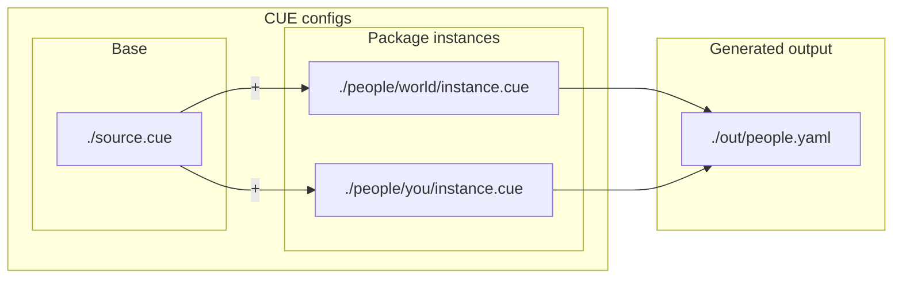

# githubactions-cue-example

Demo project to automatically generate denormalized YAML files from CUE configs.

```mermaid
flowchart LR
  subgraph CUE configs
    subgraph "Base"
      S[./source.cue]
    end
    subgraph "Package instances"
      S--"+"-->A[./people/world/instance.cue]
      S--"+"-->B[./people/you/instance.cue]
    end
  end
  subgraph "Generated output"
      A --> Y[./out/people.yaml]
      B --> Y
  end
```
